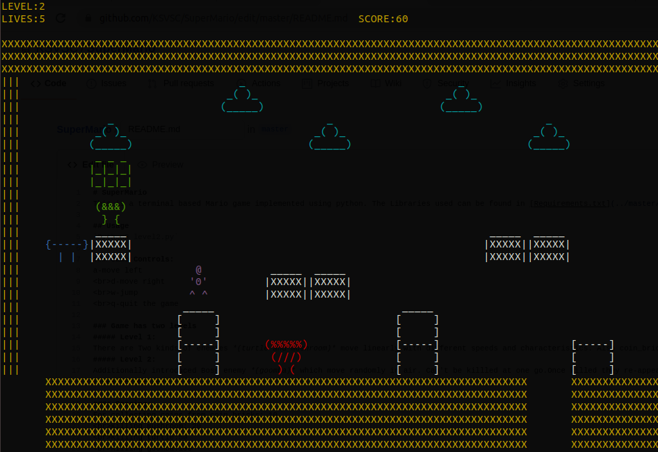

# SuperMario
This is a terminal based Mario game implemented using python. The Libraries used can be found in [Requirements.txt](../master/Requirements.txt)

## Usage
`Python3 level2.py`

### Game Controls:
a-move left
 d-move right
 w-jump
 q-quit the game

### Game has two levels
##### Level 1: 
There are Two kinds of enemies *(turtle and mushroom)* move linearly with different speeds and characteristics. Also coin_bricks where mario collect coins.
##### Level 2: 
Additionally introduced Boss enemy *(goomba)* which move randomly in air. Can't be killled at one go.Once killed they re-appear at aonther position untill their lives become zero.

#### Scoring:
For collecting coins from coin_bricks: 10.
 Killing mushroom: 20
 Killing turtle:50
 Killing goomba:100

#### Game Objects:
living
 |__mario
 |__turtle
 |__mushroom
 |__goomba
 |__coin_bricks

#### Extras:
1. Different colors for various objects using colorama.
2. Different sounds for various movements/actions of mario.
3. Enemies with different speeds.

This was implemented as part of SSAD course at IIIT-Hyderabad.
